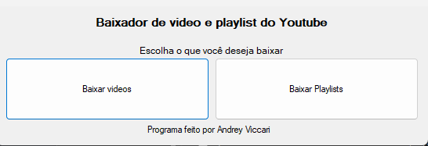
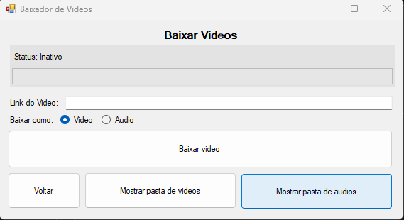
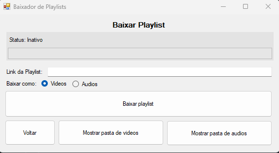

# VideoDownloader

Esté é um projeto de baixador de video do Youtube, feito com C#.

## Tecnologias Utilizadas
- C#
- Windows.Forms (.NET Framework)
- YoutubeExplode
- FFMPEG

## Instalação
1. Clone o repositório:
    ```bash
    git clone https://github.com/Viccari1/VideoDownloader.git

2. Abra o projeto no Visual Studio 2022: 
    Ele está localizado na pasta VideoDownloader/src/VideoDownloader.sln

3. Instale o FFmpeg:
    - Baixe o FFmpeg do site oficial: [FFmpeg Download](https://ffmpeg.org/download.html)
    - Extraia o conteúdo do arquivo baixado.
    - Copie o executável `ffmpeg.exe` para a pasta `bin` do projeto. O caminho deve ser algo como `VideoDownloader/src/VideoDownloader/bin/Debug` ou `VideoDownloader/src/VideoDownloader/bin/Release`, dependendo da configuração de compilação.

4. Compile e execute: Você pode fazê-lo apertando F5.

## Uso
Logo quando o programa se inicia, aparece uma tela inicial, contendo 
um titulo, e 2 botões, sendo um para baixar videos, e o outro para 
baixar playlists.  



Ao selecionar a opção de baixar videos, essa tela se oculta, aparecendo
outra no lugar, contendo uma label que mostra o status atual do download,
uma barra de progresso, um campo para digitar o link do video, opções
de baixar como video ou audio com radiobuttons, e 4 botões embaixo, sendo eles
para voltar pra tela inicial, baixar o video, mostrar pasta de videos, e mostrar
a pasta de audios.  



No entanto, ao selecionar a opção de baixar playlists a tela inicial se
oculta, e aparece outra tela, contendo os os mesmos campos que na tela 
de download de videos.  



Ao digitar o link da opção selecionada na tela inicial, e selecionando
a opção do radiobutton desejado (video ou audio), o usuário pode acionar
o botão de baixar. O video ou playlist baixado poderá ser encontrado na pasta
de video ou audio do usuário, em uma pasta denominada "Baixadas".

## Licenciamento
Este projeto está licenciado sob uma licença MIT License com Commons Clause, que proíbe o uso comercial do mesmo.

Este projeto também utiliza as seguintes bibliotecas de terceiros:

### 1. YoutubeExplode
- **Licença**: MIT License
- **Repositório**: [YoutubeExplode](https://github.com/Tyrrrz/YoutubeExplode)

### 2. FFmpeg
- Este projeto utiliza o **FFmpeg** para processamento de áudio e vídeo, que é distribuído sob a **Licença LGPL v2.1 ou v3**.
- Acesse o código-fonte do FFmpeg: [FFmpeg](https://ffmpeg.org/download.html)
- A Licença LGPL permite que o FFmpeg seja usado em software proprietário, desde que as condições da licença sejam cumpridas.

